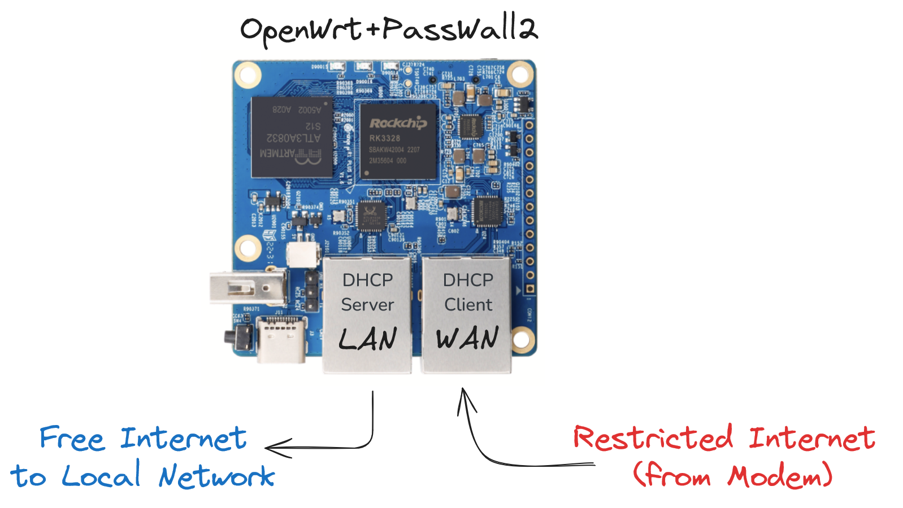

<div dir="rtl">

### فهرست مطالب

- [مقدمات](#مقدمات)
- [گام اول. سخت افزار](#گام-اول-سختافزار)
- [گام دوم: ریختن Image](#گام-دوم-ریختن-image)
- [گام سوم: پیکربندی OpenWrt](#گام-سوم-پیکربندی-openwrt)
- [گام چهارم: پیکربندی PassWall2](#گام-چهارم-پیکربندی-و-اضافه-کردن-کانفیگ-به-passwall2)

## مقدمات

در این ریپو نحوه‌ی راه‌اندازی یک فیلترشکن سخت‌افزاری با استفاده از یک SBC ارزان قیمت به نام OrangePi R1 PLUS LTS تشریح خواهد شد.
ساختار کلی عملکرد مطابق شکل زیر است.



**نکته۱**: در این آموزش ممکن است لینک‌هایی به سایت‌های فروش یا آموزشهای دیگر داده شود. این لینکها صرفا جهت راهنمایی خودم و شماست و هیچگونه جنبه‌ی تبلیغاتی نداشته و من نفعی از آن نمی‌برم.

**نکته۲**: شما می‌توانید با راهنماهای موجود در یوتیوب، مثل [این](https://www.youtube.com/watch?v=m-BAyaHNlV8)  یا سلسله راهنماهای [اینجا](https://ivpn.pro/category/openwrt/) از پایه OpenWrt را نصب کرده و سپس PassWall2 را نصب کرده و تک تک روشها را پیاده‌سازی کنید. اما بدلیل مشکلات اینترنت در ایران انجام این مراحل مشکلات زیادی دارد و همچنین ممکن است انجام آن برای همه راحت نباشد. استفاده از یک Image آماده کار شما را راحت خواهد کرد.


## گام اول: سخت‌افزار
بورد Orange Pi R1 PLUS LTS یک پردازنده‌ی ۴ هسته ۶۴ بیتی با فرکانس 1.5GHz دارد و با داشتن 1GB RAM یک سخت‌افزار مناسب برای یک روتر خانگی است. مشخصات این بورد را از [سایت سازنده](http://www.orangepi.org/html/hardWare/computerAndMicrocontrollers/details/orange-pi-R1-Plus-LTS.html) می‌توانید ببنید.

این بورد در بازار ایران نیز قابل تهیه است و مثلا در حال حاضر (مهر ۱۴۰۳) از وبسایت eca با قیمت ۲/۶۰۰/۰۰۰ تومان قابل تهیه است [لینک](https://eshop.eca.ir/%D8%AE%D8%A7%D9%86%D9%88%D8%A7%D8%AF%D9%87-orange-pi/21222-%D8%A8%D8%B1%D8%AF-%D8%A7%D9%88%D8%B1%D9%86%D8%AC-%D9%BE%D8%A7%DB%8C-orange-pi-r1-plus-lts-%D8%A8%D8%A7-%D8%B1%D9%85-1gb.html).


علاوه بر خود بورد برای راه‌اندازی آن به موارد زیر نیز نیاز است:
- آداپتور تغذیه 5V/3A با پورت Type C
- حافظه Micro SD حداقل 2GB به بالا

و همچنین لوازم جانبی مثل لپتاپ/کامپیوتر با پورت میکرو SD یا داشتن یک تبدیل میکروSD به USB و کابل شبکه برای ارتباط با روتر/SBC.


## گام دوم: ریختن Image
به مرور Imageهای آماده مختلف به صورت Shrink و فشرده شده برای استفاده با این بورد رار قرارخواهم داد. Image مدنظر خود را از جدول زیر دانلود کنید.

| عنوان | لینک دانلود | توضیحات |
| -------- | -------- | -------------------------------- |
| خام  | [لینک](https://github.com/h4med/OrangePiR1PLUSLTS-OpenWrt-PassWall2/raw/refs/heads/main/img0_Raw_v1.zip)   | در این Image سیستم عامل OpenWrt نسخه 23.05 برای بورد ما به همراه PassWall2 نصب شده است و آماده است که کانفیگهای V2Ray یا Sing-Box یا Hysteria خود را به آن مطابق آموزش [گام چهارم](#گام-چهارم-پیکربندی-و-اضافه-کردن-کانفیگ-به-passwall2) اضافه کنید.|
| خام+WarpPlus  |  [لینک](https://github.com/h4med/OrangePiR1PLUSLTS-OpenWrt-PassWall2/raw/refs/heads/main/img1_WarpPlus_v1.zip) | در این Image سیستم عامل OpenWrt نسخه 23.05 برای بورد ما به همراه PassWall2 نصب شده است و علاوه بر آن WarpPlus نصب شده و به صورت Service فعال شده است. عملا این Image هیچگونه پیکربندی خاصی نیاز ندارد و فقط باید کمی صبر کنید تا سیستم بالا آمده و سرویس Warp اجرا شود. سرویس با کلید --scan اجرا می‌شود بهمین دلیل در ابتدا کمی زمان می‌برد تا IP تمیز را پیدا کند. |


ابتدا Image مدنظر را که با فرمت Zip فشرد شده است با نرم‌افزارهایی همچون 7Zip یا نرم‌افزارهای پیش‌فرض سیستم عامل خود از حالت فشرده خارج کنید. سایز آن حدود ۲۰۰-۳۰۰ مگابایت خواهد شد.

سپس با نرم‌افزاری همچون Win32DiskImager آنرا روی حافظه‌ی MicroSD مدنظر خود بریزید. با توجه به اینکه Image به صورت Shrink شده است، می‌توانید آن را روی هر حافظه‌ای از سایز 512MB به بالا بریزید. نرم‌افزار DiskImager را می‌توانید [از اینجا](https://sourceforge.net/projects/win32diskimager/) دانلود کنید. درصورتی که از حافظه‌ای استفاده می‌کنید که قبلا استفاده شده است بهتر است یکبار آن‌را با SD Card Formatter فرمت کنید [دانلود از اینجا](https://www.sdcard.org/downloads/formatter/).


## گام سوم: پیکربندی OpenWrt
پس از برقدار کردن در صورتی که همه چیز بدرستی انجام شده باشد، و پورت WAN  به مودم و پورت LAN به لپتاپ/پی‌سی متصل باشد باید چراغ قرمز چشمک زده و چراغ‌های زردرنگ مرتبط با LAN و WAN نیز در صورت وجود Activity روی لینک چشمک بزنند.

پورت WAN: به صورت DHCP Client تنظیم شده است و از مودم/روتر اصلی که اینترنت را تامین می‌کند IP در رنج مودم خواهد گرفت.

پورت LAN: به صورت DHCP Server تعریف شده است و در رنج **192.168.123.1/24** به تجهیزاتی که به آن متصل شوند IP خواهد داد.


ابتدا در سیستمی که به SBC متصل کرده‌اید مطمئن شوید در رنج بالا بدرستی IP گرفته باشد سپس یک مرورگر بازکرده و آدرس ```http://192.168.123.1``` را باز کنید. با اینکار وارد صفحه تنظیمات روتر می‌شوید. نام کاربری ```root``` است و رمز عبور نیز ```1``` است (عدد یک).

پیشنهاد می‌شود در گام اول رمزعبور پیشفرض عوض شود. برای اینکار از منوهای بالای صفحه قسمت System و سپس Administration را انتخاب کنید. در قسمت Router Password رمز عبور جدید را وارد کنید.

سپس می‌توانید در صورت نیاز با مراجعه به منوهای بالای صفحه قسمت Network و بخش Interfaces رنج IP مدنظر خود را برای LAN تنظیم کنید. برای این کار روی دکمه‌ی آبی رنگ Edit در کنار Lan کلیک کرده و در پنجره باز شده بخش IPv4 address را به دلخواه خود ویرایش کنید.

پس از آن در گام بعد به سراع تنظیمات PassWall2 می‌رویم.


## گام چهارم: پیکربندی و اضافه کردن کانفیگ به PassWall2
ابتدا با مراجعه به ```http://192.168.123.1``` وارد صفحه‌ی پیکربندی می‌شویم (لاگین پیشفرض: ```1/root```).

از منوهای بالای صفحه Services و سپس PassWall2 را انتخاب می‌کنیم.

از تبهای موجود در این بخش قسمت Node List را انتخاب کرده و سپس Add the node via the link را می‌زنیم. کانفیگی که مطمئن هستیم روی اینترنت مدنظر ما به خوبی کار می‌کند را کپی کرده و در  کادر باز شده قسمت Share Link به صورت کامل paste می‌کنیم (برای ساخت کانفیگهای رایگان استفاده از  [BPB-Worker-Panel](https://github.com/bia-pain-bache/BPB-Worker-Panel)  پیشنهاد می‌شود). اگر لینک کانفیگ درست باشد به صورت یک سطر جدید در این بخش اضافه می‌شود.

برای اینکه پیکربندی استفاده شود روی دکمه آبی رنگ Use بزنید و سپس تایید کنید.

TODO

</div>
